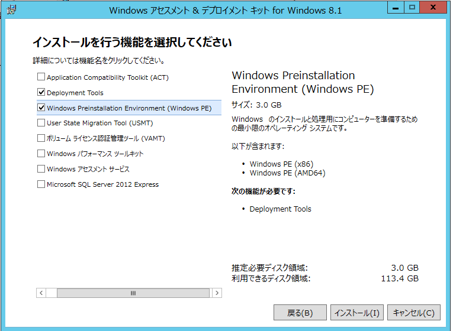

# Windows PE 起動環境作成ガイド

## BE Builder(PE)を起動

Windows PE ベースの起動環境を作成するビルダーを開始するには［ユーティリティ］メニューから BE/起動環境ビルダー（Windows PE）をクリックします。
**※IT Pro Edition では使用できません。**

[Windows ADK/AIKのインストール](#installPE) の手順に従ってインストールしてください。

### ようこそ画面

［次へ］をクリックしてください。
 
### Windows PE ツールの選択

以下のような画面になる場合には、環境にPE Kitがインストールされていません。
起動した環境にWindows PE Kitがインストールされていない場合には、MicrosoftのWebサイトからダウンロードしてインストールする必要があります。

推奨するツールはここから、というリンクをクリックして画面に従ってダウンロードしてください。

[Windows ADK/AIKのインストール](#installPE) の手順に従ってインストールしてください。

作成に使用する Windows PE ツール キットを指定します。ホストが64ビット環境の場合、32ビットの環境も作成することができます。
指定した Windows PE ツール キットの情報も表示されます。

 
［次へ］をクリックしてください。
 
### デバイス ドライバーの追加

起動環境に組み込むデバイス ドライバーを選択します。
現在のシステムに存在するネットワークとストレージのドライバーが検出されて左ペインに表示されます。［INF から追加］をクリックすると、INF ファイルを指定して一覧に無いドライバーを追加することもできます。

追加するドライバーを選択したら`［= = >］`をクリックして、組込対象に入れてください。組込対象から外す場合は対象を選択して`［< = =］`をクリックします。

※ネットワークでは有線 LAN（Ethernet）ドライバーのみサポートします。

［次へ］をクリックします。
 
### 環境の設定

表示言語とキーボード タイプ、タイムゾーン、画面解像度を指定します。

［次へ］をクリックします。
 
### 作成タイプの指定
 
PreBoot 環境を選択すると、ハードディスクから起動する起動環境をシステム ボリュームに作成します。
ISO イメージ ファイルを選択すると、指定したパスに ISO イメージ ファイルを作成します。ISO の作成後 DVD メディアに書きこむことも可能です。
USB 起動メディアを選択すると、指定した USB メモリから起動する起動環境を作成します。使用する USB メディアはドライブ文字で指定します。なお、使用する USB メモリの内容は全て消去されますのでご注意ください。

［次へ］をクリックしてください。

### 設定の確認
 
設定内容を確認します。

［戻る］をクリックすると前の設定画面に戻れます。また、ノードをクリックすることで任意の設定に戻ることができます。
［起動環境の作成］をクリックすると確認メッセージが表示され、［OK］をクリックすると作成が始まります。
 
作成の進捗が表示されます。

 
起動環境の作成が終了すると以下のメッセージが表示されます。
 
［OK］をクリックして閉じてください。
 

----

# ADK/AIK のインストール

ActiveImage Protectorでシステムのリカバリーを行う場合には起動環境のメディアを作成する必要がありますではWidowsPEをインストールする必要があります
WindowsPEには何種類かのToolKitがあり、各々インストール方法が違いますので注意してください。
 

## Windows ADK Anniversay Update 1607, 1511 

Windows ADK for Windows 10 Version 1607, 1511の
[ダウンロード](https://developer.microsoft.com/ja-jp/windows/hardware/windows-assessment-deployment-kit#adkwin10)をします。

2016年8月現在は以下のようなページになっていますので、使用するものをダウンロードしてください。

ダウンロードしたファイルを実行すると以下の画面が表示されます。
そのままインストーラーの指示に従ってADKをインストールしてください。

### 場所の指定

インストール場所の指定です。通常は変更の必要はありません。

### Windowsキット プライバシー

Microsoftに使用状況のデータを送信します。選択はどちらでも構いません。

### 使用許諾契約

初期状態はいくつかにチェックが入っています。

Windows ADK では、以下のコンポーネントをインストールすることが必要です。

* Deployment Tools
* Windows Preinstallation Environment(Windows PE)

それ以外の選択は外して問題ありません。

* Deployment Tools

* Windows Preinstallation Environment(Windows PE)

### 機能をインストールしています...

### 完了

インストールが完了しました。これでユーティリティからADKを参照することができるようになりました。

## Windows ADK 8.1 Update

[Windows 8.1 Update 用 Windows アセスメント & デプロイメント キット (Windows ADK)]((https://developer.microsoft.com/ja-jp/windows/hardware/windows-assessment-deployment-kit)のぺージへ行き、[Windows ADK for Windows 8.1を入手する ](https://go.microsoft.com/fwlink/p/?LinkId=393005) を押してください。

ダウンロードしたファイル\(adksetup.exe\)を実行すると以下の画面が表示されます。

### 場所の指定

インストール場所の指定です。通常は変更の必要はありません。

### カスタマー エクスペリエンス向上プログラム(CEIP)への参加

Microsoftに使用状況のデータを送信します。選択はどちらでも構いません。

### 使用許諾契約

使用許諾契約に同意をします。

### インストールを行う機能を選択してください

Windows ADK では、以下のコンポーネントをインストールすることが必要です。

* Deployment Tools
* Windows Preinstallation Environment(Windows PE)

それ以外の選択は外して問題ありません。

### 機能をインストールしています

### インストール完了

## Windows ADK 8.0 

特別な理由がない場合は[Windows ADK for Windows 10](#adk10)または[Windows ADK 8.1 Update](#adk81)を使ってください。

インストール手順は同じです。

## Windows AIK
AIKを動作させるにはWindows Vista, 7, Server 2003 SP1, Server 2008, Server 2008 R2である必要があります。
また.NET 2.0が必要です。

AIKはisoでの提供になります。CDに焼くかマウントしてインストールします。
CDまたはマウントすると自動起動しますが、起動しない場合はStartCD.exeをクリックして起動します。

&copy; [NetJanan,Inc.](https://www.netjapan.co.jp)

