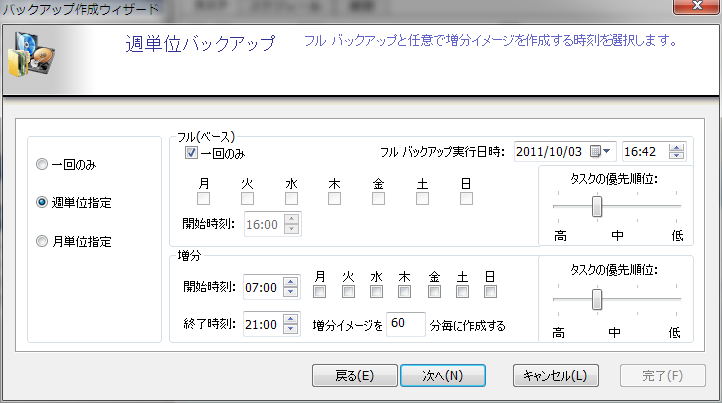

# Windoows PE のインストールガイド

AipではWidowsPEをインストールする必要があります
WindowsPEには何種類かのToolKitがあり、各々インストール方法が違いますので注意が必要です。
 
## Windows ADK Anniversay Update 1607, 1511 の Windows ADK を使用

ダウンロードしたファイルを実行すると以下の画面が表示されます。


BE Builder で必要となるのモジュールは以下のものです。それ以外の選択は外して問題ありません。

* ToolKit
* Assesment Kit

そのままインストーラーの指示に従ってＡＤＫをインストールしてください。
インストールが完了したら、BE Builderを起動しなおすとPE Kiｔの選択が可能になります。

## Windows ADK 8.1 Update のWindows ADKを使用する
ダウンロードしたファイルを実行すると以下の画面が表示されます。


BE Builder で必要となるのモジュールは、０とoなのでそれ以外の選択は外して問題ありません。
そのままインストーラーの指示に従ってＡＤＫをインストールしてください。
インストールが完了したら、BE Builderを起動しなおすとPE Kiｔの選択が可能になります。

## Windows ADK Windows 7 のWindows ADKを使用する
ダウンロードしたファイルを実行すると以下の画面が表示されます。


BE Builder で必要となるのモジュールは、０とoなのでそれ以外の選択は外して問題ありません。
そのままインストーラーの指示に従ってＡＤＫをインストールしてください。
インストールが完了したら、BE Builderを起動しなおすとPE Kiｔの選択が可能になります。
## Windows AIK を使用する
ダウンロードしたファイルを実行すると以下の画面が表示されます。


BE Builder で必要となるのモジュールは、０とoなのでそれ以外の選択は外して問題ありません。
そのままインストーラーの指示に従ってＡＤＫをインストールしてください。
インストールが完了したら、BE Builderを起動しなおすとPE Kiｔの選択が可能になります。

```
code

```
* `mkdocs serve` - Start the live-reloading docs server.
* `mkdocs build` - Build the documentation site.
* `mkdocs help` - Print this help message.

## Project layout

    mkdocs.yml    # The configuration file.
    docs/
        index.md  # The documentation homepage.
        ...       # Other markdown pages, images and other files.
